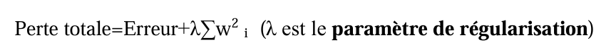
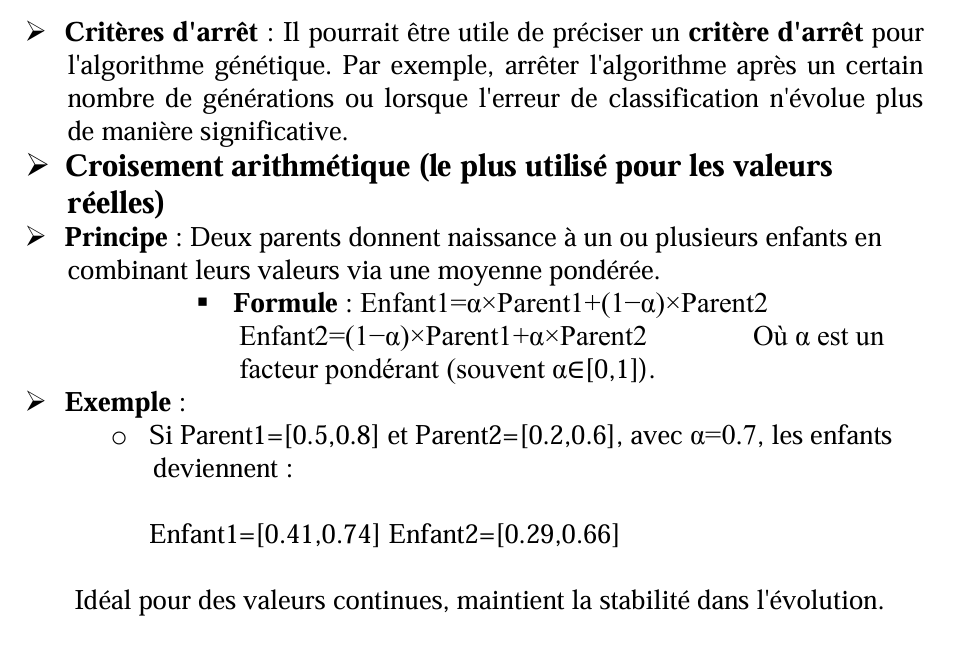

# Genetic-Algorithm

* [X] Utilisez une version simplifiée du dataset MNIST en ne sélectionnant que les chiffres 0 et 1 pour une tâche de classification binaire(classe 0 ou classe 1).
* [X] Implémentez un MLP avec la bibliothèque scikit-learn (MLPClassifier) ou une autre bibliothèque similaire.
* [ ] Optimiser le Nombre de neurones dans la couche cachée
* [ ] Optimiser le Taux d'apprentissage
* [ ] Optimiser les Paramètres de régularisation
* [ ] Optimiser Les poids et les biais (paramètres du MLP)
* [ ] Affichez l'évolution de l'erreur de classification (fitness) au fil des générations.

**INDICATIONS:**

* [ ] Définir le chromosome (individu) et taille de la population
* [ ] **Évaluation (fitness)** : Pour chaque individu, entraînez le MLP et calculez l'erreur de classification sur un ensemble de validation.
* [ ] Utilisez la méthode de roulette pour choisir les individus pour la reproduction.
* [ ] Le paramètre de régularisation est une valeur ajoutée à l'équation d'apprentissage pour réduire le risque de sur-apprentissage (overfitting), où le modèle devient trop spécifique aux données d'entraînement et généralise mal sur des données nouvelles. Il pénalise les poids (wi) du modèle en ajoutant un terme dans la fonction de perte, encourageant des valeurs de poids plus petites ou plus stables.

Si la fonction de perte initiale est Erreur(yprédit,yvrai), après régularisation elle devient :

Une valeur λ élevée applique une forte pénalisation, rendant le modèle plus
simple pour éviter le sur-apprentissage. Tandis que, une valeur λ faible réduit
l’effet de la régularisation, laissant plus de liberté au modèle pour s’ajuster. Dans
un MLP, ce paramètre est souvent appelé alpha dans des bibliothèques comme
scikit-learn.

# Results

* [ ] Affichez les meilleurs hyperparamètres et leur erreur associée pour chaque génération.
* [ ] Visualisez l'évolution de l'erreur minimale de classification.
* [ ] Graphique montrant l'évolution de la précision
* [ ] Comparer et discuter les résultats obtenus par MLP seul puis MLP optimisé par AG.
